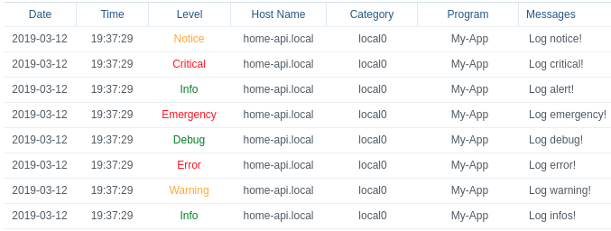

# node-syslog-client-bsd

[](https://greenkeeper.io/)

Wrapper for https://www.npmjs.com/package/syslog-client package

## Install

`yarn add node-syslog-client-bsd` or `npm i node-syslog-client-bsd`

## Usage

### Import package

```javascript

const SyslogClient = require("node-syslog-client-bsd");

```

### `new SyslogClient(IP, [options]);`

- `IP`: IP of your syslog server
- `[options]`: can be find here : https://www.npmjs.com/package/syslog-client#syslogcreateclienttarget-options

> Return new instance of SyslogClient (constructor)

```javascript
const options = {
  syslogHostname: 'home-api.local',
};

const logClient = new SyslogClient('10.0.0.15', options);
```

### `SyslogClient.getClient()`

> Return the instance of syslog-client based on [syslog-client package](https://www.npmjs.com/package/syslog-client)

### `SyslogClient.setProgram(program)`

> sets the program for all calls according to the setter

### `SyslogClient.resetProgram()`

> reset the program for all calls according to the reset

### `SyslogClient.setFacility(facility)`

> sets the facility for all calls according to the setter

### `SyslogClient.resetFacility()`

> reset the facility for all calls according to the reset


### `log(message, [program], [options])` 

- `message`: message to log
- `[program]`: set the program specific for one log. Default `N/A`
- `[options]`: options based on [syslog-client options](https://www.npmjs.com/package/syslog-client#clientlogmessage-options-callback). It overloads what you've already set up

**you have access to all these functions depending on the level**

```javascript
logClient.info('Log infos!');
logClient.warning('Log warning!');
logClient.error('Log error!');
logClient.debug('Log debug!');
logClient.emergency('Log emergency!');
logClient.alert('Log alert!');
logClient.critical('Log critical!');
logClient.notice('Log notice!');
```

## Example

You can find an example in `./example/index.js`. The screenshot below shows you its result (on an Synology NAS)



## Useful links

- https://www.npmjs.com/package/syslog-client
- https://www.ietf.org/rfc/rfc3164.txt
- https://tools.ietf.org/html/rfc5424

## Changelog

### March 2019

- Init project